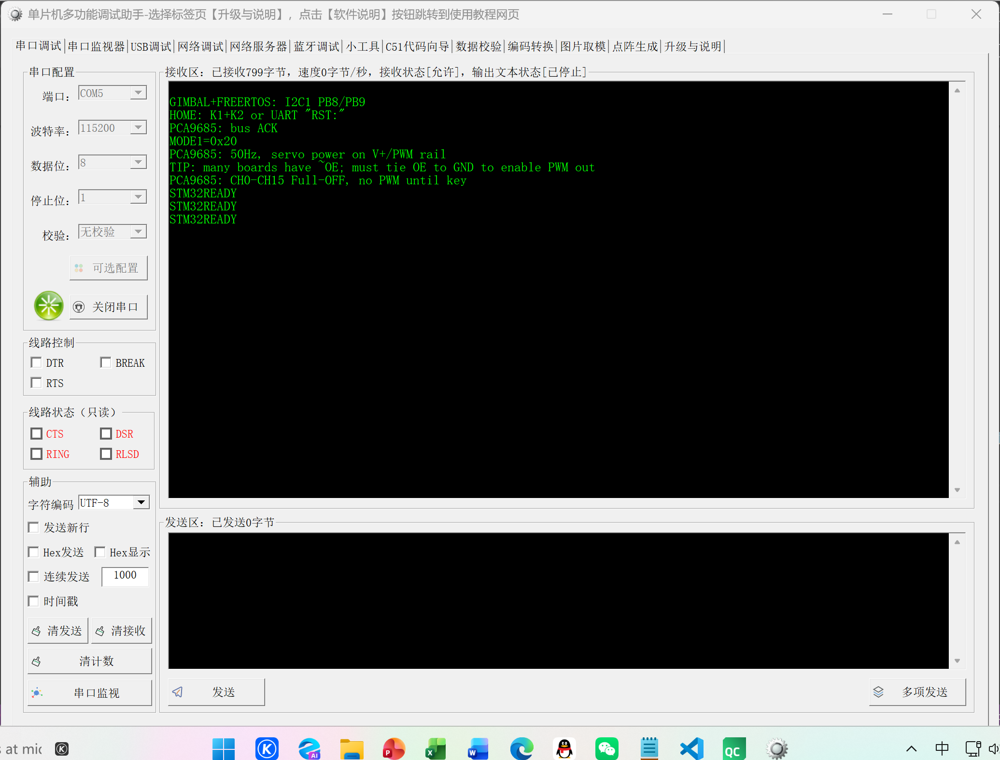
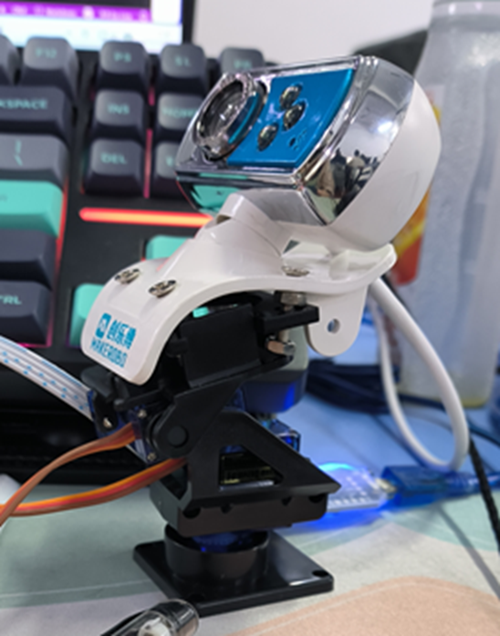
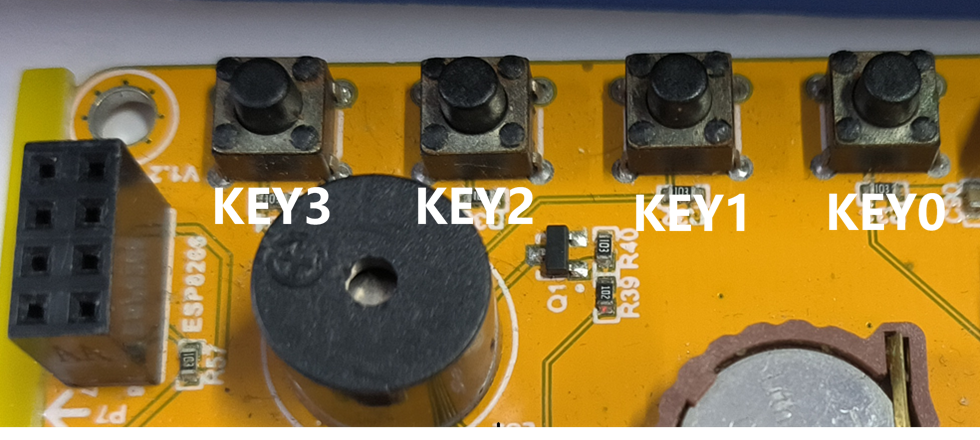
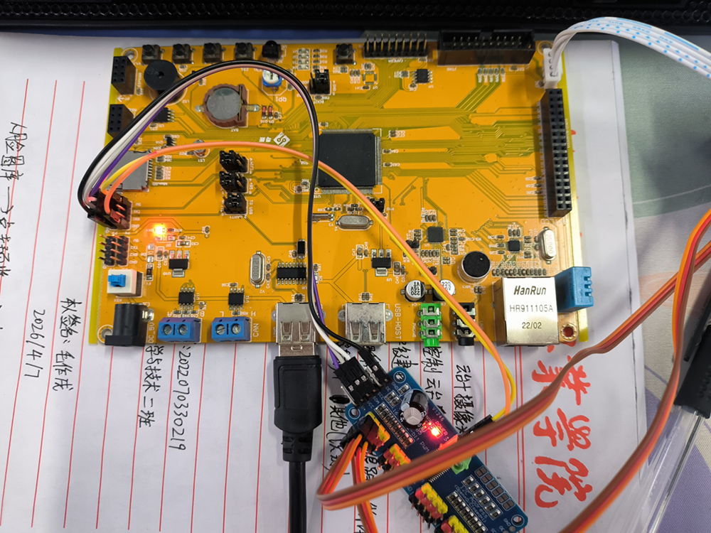

# 智能扫视云台

## 项目概述

基于使用STM32F4系列芯片的单片机核心板为下位机，QT应用为上位机控制端的云台舵机驱动控制与摄像头视频流传输处理系统组合。实现对舵机的运动控制、视频的查看、录制与截图以及物体和人脸的识别以及对人脸的自动追踪。系统采用上下位机区分，多线程分离控制。

## 技术栈

- **下位机**: FreeRTOS + IIC + USART + PWM
- **上位机**: C++ + QML
- **构建工具**: CMake
- **识别模块**: OpenCV + YOLO8 + SeetaFace6Open

## 核心功能模块

### 1. 实时预览
- 控制：摄像头选择，云台串口和波特率选择，截图与录像，扫描并跟踪人脸，云台复位
- 识别：人脸识别（seeta或opencv自带模型），物体识别（yolov8m、yolov8n），识别输出（绘制框、物体名、汇报是否有人脸）
- 按键输出：串口收发日志

### 2. 截图图库
- 预览：点击列表图片右侧预览
- 删除：点击按钮删除
- 存储路径：D:/Camera-Data/face_gallery（首次启动自动创建）

### 3. 录像库
- 播放：点击按钮播放
- 删除：点击按钮删除
- 识别：播放页可选择识别物体和人脸（无绘制框）并输出物体名汇报是否有人脸

### 4. 舵机控制
- 键盘控制：WSAD进行控制，点击视频预览页的视频窗口将焦点聚焦在键盘上
- 单片机控制：单片机的按键控制，按下按键进行一次移动

## 工程关键代码

将工程内主要的代码进行了打包，不包含识别模块的dll文件，只用于快速浏览工程底层代码实现，不保证在你导入到自己工程内能直接运行。

## 硬件设备与接线

必须：16路PWM舵机驱动板，云台，摄像头。本工程使用的是创乐博的云台摄像头组件。

接线：将PWM舵机驱动板接入手中的核心板PWM输出引脚即可，舵机电源可使用板间5V电源（舵机需求电源为5V时）

## 快速开始

### 1. 解压完整工程压缩包

### 2. 将解压的单片机工程编译并烧录

烧录后连接串口调试助手并按下开发板上按键进行测试。KEY0:摄像头被抬起，KEY1:摄像头被放下，KEY2:摄像头被向右移动，KEY3:摄像头被向左移动，同时按下KEY0和KEY1:摄像头被复原到初始位置。

如图，串口输出STM32READY证明单片机可连接可控制

舵机初始位置

单片机按键

单片机接线，16路舵机驱动板的1路接纵向控制舵机，2路接横向控制舵机

### 3. QT应用解压后点击exe文件运行

注意：里面包含了人脸/物体识别模型文件，如果解压后出现应用错误、进不去等异常，是由于关键dll文件缺失导致的，需要重新解压，或者前往对应git仓库下载

- SeetaFace6Open: https://github.com/SeetaFace6Open/index.git
- YOLO: https://github.com/ultralytics/ultralytics.git

## 作者

Corkedmzx

## 许可证

MIT License
